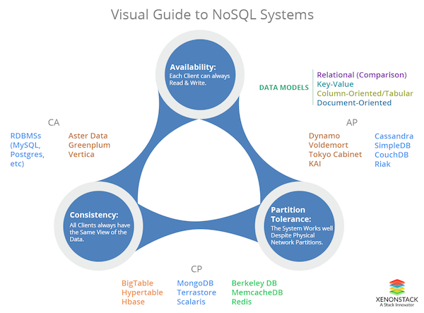

# Introduction en NoSQL 

Ingesup B3 / YNOV / 2018

---

~~NoSQL = MongoDB~~

---

## Household

- Mickael Tardy
- mickael.a.tardy@gmail.com
- https://www.linkedin.com/in/mickael-tardy-54723235
- https://github.com/miketardy-ynov-classroom/ynov-b3-nosql-support

---

## Planning 

- Introduction
- Un peu d'historique 
- Quelques notions 
- Cas d'utilisation 
- Types de base de données 

---

## Introduction 
### Objectifs

- Rappels sur la conception des bases de données 
- Présentation du monde au delà des bases de données relationnelles 
- Mise en pratique

---

## Introduction
### Définitions

- SQL : Structured Query Language 
- DBMS : database-management system
- RDMS : relational database management system 

- NoSQL ?

---

## Notions 
### Avant NoSQL

- Bases de données relationnelles avec DBMS MySQL, MSSQL, PostreSQL
- Bases de fichiers 

---

## Notions
### Avant NoSQL

Utilisations inadaptées des bases de données relationnelles

- Stockage d'informations sans modèle rigide
- Table unique à taille colossale 
- Tables grandissante en horisontale 

---

## Notions 
### ACID 

en: Atomicity, Consistency, Isolation, Durability 

* Atomicité : une transaction si réalisée, se fait intégralement (tout ou rien)
* Cohérence : une transaction transforme le système d'un état valide vers un autre état valide
* Isolation : les transactions ne peuvent pas être interdépendantes 
* Durabilité : le résultat de la transaction est demeure enregistré malgré les dysfonctionnements survenus après la transaction

https://en.wikipedia.org/wiki/ACID

---

## Notions 
### Théorème CAP 

en: Consistency, Availability, Partition tolerance

- Cohérence (en: Consistency ) : tous les clients du système accèdent et voient les mêmes données;
- Disponibilité (en: Availability) : Tous les client peuvent lire et écrire;
- Tolérance au partitionnement (en: Partition Tolerance) : le système garantit de donner une réponse malgré le partitionment de l'infrastructure.

---

## Notions 
### Théorème CAP 

---
## Notions
### BASE

en: Basically Available, Soft state, Eventual consistency

- Basically Available: disponibilité sur principe. Une transaction peut ne pas générer une réponse, mais le système fera son mieux pour l'appliquer
- Soft state: l'état du système peut changer même sans aucune entrée de données
- Eventually consistent: le système deviendra consistant après une certaine période de stabilisation

https://en.wikipedia.org/wiki/Eventual_consistency

---

## Historique
### Les origines 

- Première apparition en 1998 avec l'introduction d'un RDMS sans SQL https://en.wikipedia.org/wiki/Strozzi_NoSQL
- Première définition nouvelle génération en 2009 http://blog.sym-link.com/2009/05/12/nosql_2009.html
- Long chemin parcouru depuis

---

## Historique
### Aujourd'hui

Suivant http://nosql-database.org

NoSQL DEFINITION: Next Generation Databases mostly addressing some of the points: being non-relational, distributed, open-source and horizontally scalable.

---

## Historique
### Aujourd'hui

NoSQL : toute base de données avec un modèle différent du modèle relationnel traditionnel

---

## Cas d'utilisation

(Draw.io)

---

## Types de bases de données NoSQL

- Basés sur les clefs-valeurs (en: key-value stores)
- Basés sur les documents (en: document stores)
- Basés sur les lignes et colonnes (en: wide column stores)
- Basés sur les graphs (en: graph databases)

---
## Quelques exemples de solutions NoSQL
### Key-value stores

- Redis
- Hazelcast
- Infinispan

---

## Quelques exemples de solutions NoSQL
### Document stores

- MongoDB
- Couchbase
- CouchDB

---

## Quelques exemples de solutions NoSQL
### Wide Column stores

- Cassandra
- HBase

---

## Quelques exemples de solutions NoSQL
### Graph databases

- Neo4J
- OrientDB (multi-model)
- ArangoDB (multi-model)

---

## Quelques exemples de solutions NoSQL
### Cool stuff 

- MySQL / JSON
- MySQL / Document Store
- BigchainDB https://www.bigchaindb.com

---

## Conception 
### Environnement (1)

- Solutions ODM (en: Object Document Mapper) et ORM (Object-Relational Mapping) présentes dans plusieurs langages:  
  - PHP : doctrine
  - Java : Spring Data / Hibernate
  - Javascript : Sequelize, Mongoose

---

## Conception 
### Environnement (2)
  
- Plusieurs DBMS ont un langage de requête  
  - CQL pour Cassandra 
  - MongoDB Query Language 
  - Cypher pour Neo4J

---

## Conception 
### Design de la solution

- Question essentielle : comment choisir ?

---

## Conception 
### Design de la solution

- Identifier le problème 
- Spécifier le/les modèle(s) de données 
- Spécifier les exigences 

---

## Conception 
### Savoir s'adapter

- Appliquer la théorème CAP
- Profiter de l'environnement de développement existant
- Prendre en compte Compétences disponibles 
- https://db-engines.com

---

## Conception 
### Faire un choix judicieux

- Il n'existe pas de "one tool to rule them all"
- Chaque solution a un contexte où elle performe le mieux
- Chaque solution a des pours et des contres

---

## Conception 
### Quelques recettes

- Objets et propriétés connues, objets liés par des rélations : BDD rélationnelle (ex. MySQL)
- Structures souples et complexes, pas de relations : Document Store (ex. MongoDB)
- Grosses quantités de données sans relations : Column Store (ex. Cassandra)
- Besoin d'accès aux donnés rapide : Key-Store (ex. Redis)
- Plusieurs types d'objets et plusieurs relations souples : Graph Database (ex. Neo4J)

---

## Resources 

- https://db-engines.com
- https://github.com/orientechnologies/spring-data-orientdb
- https://projects.spring.io/spring-data-neo4j/
- https://neo4j.com/developer/cypher-query-language/
- https://github.com/sindresorhus/awesome-nodejs
- https://redis.io/topics/introduction
- http://vschart.com/compare/jboss-infinispan/vs/redis-database
- https://db-engines.com/en/systems/Redis
- https://www.couchbase.com/comparing-couchbase-vs-mongodb
- https://scalegrid.io/blog/cassandra-vs-mongodb/
- https://dzone.com/articles/the-top-10-reasons-to-use-cassandra-database
- https://www.objectrocket.com/blog/how-to/top-5-redis-use-cases